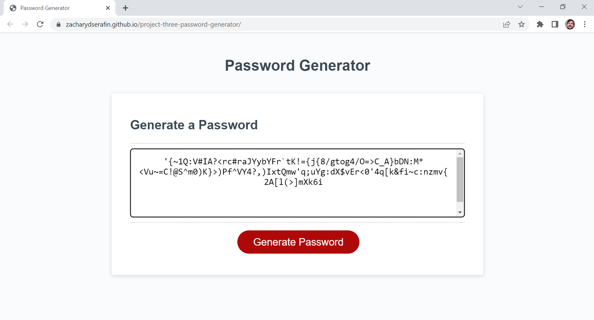

# University of Arizona Coding Boot Camp: Project Three - Password Generator

*Challenge 03 - Utilizing skills we learned in "Module 3: Javascript"*

## Description

The goal of Project (or Challenge) Three was to create a functional password generator application. I was given the HTML framework and the CSS layout, along with a few portions of the Javascript to get started with. Then, I added a series of prompts to ask the user what characters they want included in their passwords, from the four categories of lowercase letters, uppercase letters, numbers, and special characters. The series of prompts then asks the user how long the generated password should be. As long as the user selects at least one character type, a function is called to generate a password following the criteria selected via the prompts. The selections can be viewed in the console as the user moves through the series of prompts.

## Screenshot



## Links

*Link to deployed webpage:* https://zacharydserafin.github.io/project-three-password-generator/

*Link to GitHub repository:* https://github.com/zacharydserafin/project-three-password-generator/

## Authors and Acknowledgment

*University of Arizona Coding Bootcamp (Powered by edX)*: provided the source code for the HTML and the CSS stylesheet.

*Stack Overflow*: I referenced the following line of code from user "Rubinous" at https://stackoverflow.com/a/54363513/

This answer was pertaining to the question "Generate random password string with requirements in javascript" and the answer cited below was posted on January 25th, 2019.

```
const generatePassword = (
  passwordLength = 12,
  passwordChars = '0123456789ABCDEFGHIJKLMNOPQRSTUVWXYZabcdefghijklmnopqrstuvwxyz',
) =>
  [...window.crypto.getRandomValues(new Uint32Array(passwordLength))]
    .map(x => passwordChars[x % passwordChars.length])
    .join('');'
```